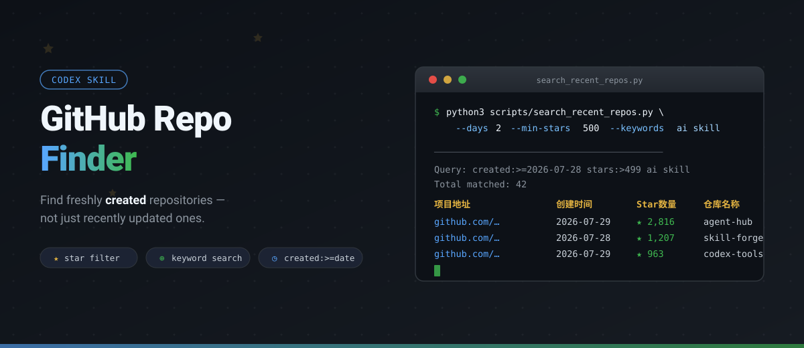

<p align="center">
  
</p>

Most GitHub searches sort by **updated** or **pushed** date, burying brand-new projects under years of activity from established repos. **GitHub Repo Finder** flips the filter: it searches by `created:` date, so you see what was *born* in the last N days — not what was merely touched.

Built as a [Codex Skill](https://github.com/openai/codex), it gives your AI agent a repeatable, scriptable way to answer questions like:

> "最近两天 GitHub 上新建的 AI 项目有哪些？"
> "Find repos created in the last 3 days with 500+ stars about Three.js."

---

<p align="center">
  
</p>

### Install

**Option 1 · With npx**

```bash
$ npx skills add tomoncle/github-repo-finder
```

**Option 2 · Ask your Agent**

```bash
> Install this Skill: https://github.com/tomoncle/github-repo-finder
```

**Option 3 · Git Clone**

```bash
$ git clone https://github.com/tomoncle/github-repo-finder ~/.codex/skills/github-repo-finder
$ git clone https://github.com/tomoncle/github-repo-finder ~/.claude/skills/github-repo-finder
```

### First search

```bash
$ cd ~/.codex/skills/github-repo-finder
$ python3 scripts/search_recent_repos.py \
  --days 2 \
  --min-stars 500 \
  --keywords ai skill \
  --format table
```

Output:

```
Query: created:>=2026-07-28 stars:>499 ai skill
Total matched: 16
项目地址          | 创建时间   | Star数量| 仓库名称
------------------+------------+---------+-----------
github.com/…      | 2026-07-29 | ★ 2,816 | agent-hub
github.com/…      | 2026-07-28 | ★ 1,207 | skill-forge
github.com/…      | 2026-07-29 | ★   963 | codex-tools
```

---

<p align="center">
  
</p>

<p align="center">
  
</p>

1. **Pick a creation window** — `--days 2` or `--since 2026-07-28`.
2. **Add keywords** — `--keywords three.js ai` searches name, description, and README.
3. **Set a star floor** — `--min-stars 100` keeps only popular repos.
4. **Refine** — `--must-have` requires a phrase; `--exclude` removes noise.
5. **Choose output** — `--format table` for console tables, `--format list` for detailed entries.

The script queries the GitHub Search API with `created:` filters, verifies each result's `created_at` falls inside the requested window, and returns only matching public repos.

---

<p align="center">
  
</p>

| Flag | Type | Default | Description |
| --- | --- | --- | --- |
| `--days` | `int` | — | Search repos created within the last N days (UTC) |
| `--since` | `str` | — | Search repos created on or after `YYYY-MM-DD` |
| `--keywords` | `str…` | `[]` | Keywords to match in name, description, README |
| `--must-have` | `str…` | `[]` | Terms that **must** appear in results |
| `--exclude` | `str…` | `[]` | Terms to exclude from results |
| `--min-stars` | `int` | — | Minimum star count |
| `--language` | `str` | — | Filter by programming language |
| `--per-page` | `int` | `20` | Results per API page (max 100) |
| `--max-results` | `int` | `20` | Maximum results to display |
| `--sort` | `str` | `created` | Sort field: `created`, `stars`, `updated` |
| `--order` | `str` | `desc` | Sort order: `asc` or `desc` |
| `--format` | `str` | `table` | Output format: `table` or `list` |

---

## Configuration

| Environment variable | Purpose |
| --- | --- |
| `GITHUB_TOKEN` / `GH_TOKEN` | Authenticate to raise API rate limits |
| `AGENT_HTTP_PROXY` | HTTP proxy; the script tries it first, then falls back to a direct connection automatically |

- The script prepends `http://` to `AGENT_HTTP_PROXY` if no scheme is present.
- All connections use a **10-second timeout** to avoid hanging on unreachable endpoints.

## Example prompts for your agent

```text
最近两天创建的 AI skill 仓库有哪些？
```

```text
Find GitHub repos created in the last 3 days about Three.js with at least 100 stars.
```

```text
最近一周新建的 Claude / Codex 相关开源项目，排除 fork，按 star 排序。
```

## File structure

```
github-repo-finder/
├── SKILL.md                        # Skill definition for Codex
├── README.md                       # This file
├── assets/readme/                  # README visual assets (SVG)
│   ├── hero.svg
│   ├── section-quickstart.svg
│   ├── section-workflow.svg
│   ├── section-reference.svg
│   └── workflow.svg
└── scripts/
    └── search_recent_repos.py      # Search script (Python 3, stdlib only)
```

## Notes

- Uses only the Python 3 standard library — no `pip install` needed.
- Prefers `created:` filters; never uses `pushed:` or `updated:` for date windows.
- Returns only public repositories unless you ask otherwise.
- When the user says "最近两天", the Skill interprets it as the last 2 calendar days in UTC.

